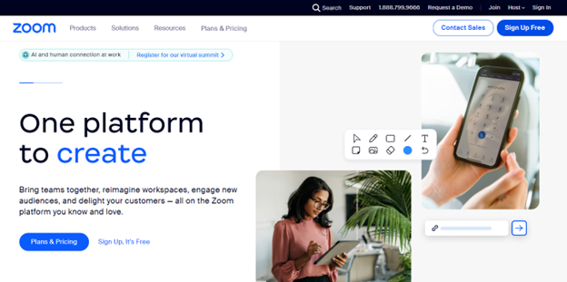
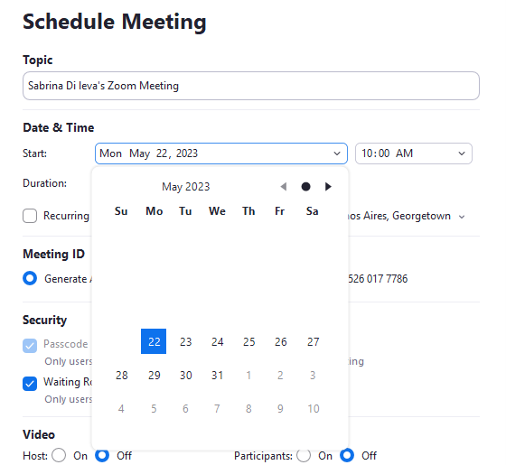

# Complete Guide: Setting Up Your First Zoom Call

A Beginner's Ultimate Guide to Mastering Zoom and Enhancing Your Video Conferencing Experience

## Target audience
Individuals who have never used Zoom before and want to set up their first call.

## Purpose
The purpose of this guide is to provide a comprehensive and easy-to-follow resource that enables users to set up their first Zoom call successfully. 

## Prerequisites and Preparations
Before diving into the step-by-step instructions, it's essential to ensure you have the following prerequisites:
* Ensure that your computer or laptop meets the minimum system requirements to run Zoom smoothly. Visit the Zoom website for the latest system requirements.
* Set Up a Gmail Account: If you don't have a Gmail account, create one by visiting the Gmail website and following the sign-up instructions.
* Make sure you have a compatible web browser (Google Chrome, Mozilla Firefox, Safari, etc.) installed on your computer. If needed, update your browser to the latest version.
* Ensure that you have a stable and reliable internet connection.
* Check if you have a working microphone and webcam. For better audio quality, consider using headphones or a headset.

# Step-by-step guide

## Create an account

1.	Open your web browser and go to the official [Zoom website](https://zoom.us/).

2.	Click on the "Sign Up Free" button at the top-right corner of the page.

3.	Follow the on-screen instructions to sign up for a free Zoom account using your Gmail email address.

    3.1	Verify your age and continue.

    

    3.2.	Insert your Gmail email address and continue.
    

    3.3.	Check your email inbox for a message from Zoom. Locate the email with the subject line containing the verification code. Open the email and copy the 6-digit verification code provided.

    3.4	Return to the Zoom sign-up page and enter the verification code in the appropriate field.
    

    3.5	Enter your full name and create a secure password for your Zoom account.
    

    3.6.	Ensure your password meets the specified requirements.

    

## Download Zoom
1.	After completing the sign-up process, you will be redirected to your [Zoom home page](https://zoom.us/myhome). 
If you are not automatically signed in, click on the "Sign In" button located at the top-right corner of the page. Enter your Zoom account credentials (email and password).

2.	Click on the "Download Now" button.

3.	You will be redirected to Zoom Downloads. Click on the "Download" button to download the Zoom client for your operating system (Windows, macOS, or Linux).

4.	Run the downloaded file and follow the installation instructions to complete the installation of the Zoom application.

## Starting your first call
This section presents a detailed guide on the different methods for creating a Zoom meeting. Explore the various approaches outlined here to begin your video conferencing experience effortlessly.

### Launching Zoom from the Application
By launching the Zoom application, you will gain access to a range of features and options for creating and managing meetings.

#### Starting an Instant Meeting
An instant meeting allows you to quickly start a Zoom session without prior scheduling. Before clicking on the "New Meeting" button, you can configure the following options:

* Start Without Video: This will initiate the meeting with your audio enabled while keeping your video turned off.
* In Zoom, your Personal Meeting ID (PMI) is a unique and permanent ID associated with your Zoom account. Using your PMI can be helpful for regular or recurring meetings, as it eliminates the need to generate a new meeting ID for each session. This ensures that the same meeting ID is used for every instance of the meeting, making it easier for participants to remember and join your meetings consistently.
* Meeting ID: By default, Zoom assigns a unique meeting ID for each meeting you create. Before starting the meeting, you will see a long number displayed, representing the meeting ID. This meeting ID can be shared with participants for them to join your meeting.
    * If you need to share the meeting ID manually, you can click on the "Copy ID" option. This will copy the meeting ID to your clipboard, allowing you to paste it in an email, chat, or any other communication medium.
    * Clicking on "Copy Invitation" copies the meeting invitation details to your clipboard. The invitation includes the meeting ID, meeting link, and other relevant information. For example, it may include details such as the meeting topic, date, time, and any agenda or attachments you included.
    * Personal Meeting ID (PMI) settings allow you to customize and configure specific options for your recurring meetings. These settings ensure consistent preferences and behaviors for all meetings scheduled using your PMI.

* Waiting room:  The waiting room is a virtual staging area where participants wait until you admit them into the meeting. You can enable or disable the waiting room feature for participants joining your meetings using your PMI. Enabling the waiting room allows you to review and control who enters your meeting, enhancing security and reducing disruptions.
* Video: Determine the default video settings for participants joining your meetings using your PMI. You can choose whether participants' video should be on or off when they join the meeting.

After configuring your desired PMI settings, make sure to click on the "Save" button to save your preferences.

Once you have set up and customized the PMI settings to your satisfaction, you can proceed to start the instant meeting by clicking the "New Meeting" button.

#### Scheduling a Meeting 
Scheduling a meeting in advance allows you to plan and organize your virtual gatherings more efficiently. In this section, we will explain how to schedule a meeting using the Zoom application. By following these steps, you can ensure that your meeting is set up with all the necessary details and easily share the invitation with participants.

1.	Click on the "Schedule " button.

    

2.	A scheduling form will appear, allowing you to enter the meeting details.
    
    

3.	Enter a descriptive title for your meeting in the "Topic" field.
4.	Specify the date and time for your meeting. Use the calendar or date picker to select the desired date and time.
 
    

5.	Customize the duration of the meeting by specifying the start and end times. Zoom’s free version has a 40-minute time limit on meetings. 

    

6.	Optionally customize the meeting password. You can enter a strong password that participants will need to enter before joining the meeting. Make sure to communicate the password securely to the invited participants.
7.	Waiting room: When participants join the meeting, they will be placed in a virtual waiting area until you admit them individually or as a group. This allows you to control who enters the meeting, adding an extra layer of security.

    

8. Video: Determine the default video settings for participants joining your meetings. You can choose whether participants' video should be on or off when they join the meeting.

    

9. Calendar Integration: Zoom offers seamless integration with popular calendar applications such as Outlook, Google Calendar, and other calendar platforms. This integration ensures that your Zoom meetings are synchronized with your calendar, allowing you to manage your schedule efficiently and receive timely reminders for upcoming meetings.
Remember to click on the "Save" or "Schedule" button after configuring all the meeting details and calendar integration options. By following these steps, you can schedule a meeting via the Zoom application, ensuring that all the necessary details are set and the invitation is ready to be shared with participants. 

    

Remember to click on the "Save" or "Schedule" button after configuring all the meeting details and calendar integration options. By following these steps, you can schedule a meeting via the Zoom application, ensuring that all the necessary details are set and the invitation is ready to be shared with participants.

#### Joining a Zoom Meeting
* Joining via Meeting Invitation Link:
    1.	Click on the meeting invitation link provided by the host.
    2.	The link will redirect you to the Zoom application.
    3.	If prompted, enter your name and select the audio and video settings you prefer.
* Joining via Meeting ID:
    1.	Open the Zoom application on your computer or mobile device.
    2.	Click on the "Join" button.

    

    3.	Enter the meeting ID provided by the host. Also enter your name and select the video settings you prefer. Click on the "Join" button to join the meeting.

    

#### Joining via Calendar Integration
1.	Go to Google Calendar and sign in to your Google account.
2.	Look for the event in your Google Calendar that corresponds to the Zoom meeting you want to join. The event should display the meeting title, date, and time.
3.	Click on the event in your Google Calendar to open the event details.
4.	Within the event details, you should find the Zoom meeting information. Look for the Zoom meeting link, which is usually located in the event description.
5.	Click on the Zoom meeting and it will open directly in the Zoom application.
6.	If prompted, enter the meeting ID and password provided in the event details.
7.	Choose your desired audio and video options based on your preferences and meeting requirements. You can enable or disable your microphone, camera, and speaker as needed.

### Active Participation during the Meeting
#### Audio and video options
You can find the audio and video controls at the bottom left corner of the Zoom meeting window. Enable or disable your microphone and camera by clicking on the respective icons.

#### Security
In the Security menu, you can manage options such as:
* Lock Meeting: Prevent additional participants from joining the meeting.
* Enable Waiting Room: Place participants in a virtual waiting area before allowing them into the meeting.
* Manage Participants: Control and monitor participants' audio, video, and screen sharing permissions.
* Chat: Manage chat privileges, allowing participants to send messages to everyone or only the host.
* The "Sharing Whiteboard" feature allows participants to collaborate on a shared virtual whiteboard. It provides a digital canvas where participants can draw, write, and annotate using various tools such as pens, shapes, and text.
* "Collaborate with Zoom Apps" refers to the integration of third-party applications within the Zoom meeting environment. These apps can be accessed through the Zoom App Marketplace and provide additional functionality tailored to specific needs.
* Suspend Participant Activities: When enabled, the host can temporarily restrict participants from performing certain activities such as screen sharing, chat, and annotating content.

#### Participants
To invite more people to a Zoom meeting, you can utilize the "Participants" dropdown menu. 

* The button “Invite” opens a pop-up that allows you to invite participants from your Zoom contacts list.
* "Copy Invitation" enables you to copy the meeting invitation text, including the meeting link, meeting ID, and any other information, which you can then share via email, messaging apps, or any other desired communication method.

The Participants panel can be accessed by clicking on the "Participants" button in the Zoom meeting toolbar. The panel displays a list of participants currently in the meeting. They are organized in alphabetical order by default.

* The host has access to various controls for managing participants listed in the Participants panel. Controls typically include options to mute/unmute their audio and rename their display name.

* Clicking on the "More" button reveals additional options for managing participants, such as allowing participants to rename themselves, allowing them to unmute themselves, and more.

