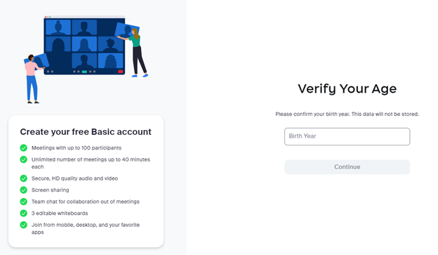

# Complete Guide: Setting Up Your First Zoom Call

A Beginner's Ultimate Guide to Mastering Zoom and Enhancing Your Video Conferencing Experience

## Target audience
Individuals who have never used Zoom before and want to set up their first call.

## Purpose
The purpose of this guide is to provide a comprehensive and easy-to-follow resource that enables users to set up their first Zoom call successfully. 

## Prerequisites and Preparations
Before diving into the step-by-step instructions, it's essential to ensure you have the following prerequisites:
* Ensure that your computer or laptop meets the minimum system requirements to run Zoom smoothly. Visit the Zoom website for the latest system requirements.
* Set Up a Gmail Account: If you don't have a Gmail account, create one by visiting the Gmail website and following the sign-up instructions.
* Make sure you have a compatible web browser (Google Chrome, Mozilla Firefox, Safari, etc.) installed on your computer. If needed, update your browser to the latest version.
* Ensure that you have a stable and reliable internet connection.
* Check if you have a working microphone and webcam. For better audio quality, consider using headphones or a headset.

# Step-by-step guide

## Create an account

1.	Open your web browser and go to the official [Zoom website](https://zoom.us/).

2.	Click on the "Sign Up Free" button at the top-right corner of the page.

3.	Follow the on-screen instructions to sign up for a free Zoom account using your Gmail email address.

    3.1	Verify your age and continue.

    

    3.2.	Insert your Gmail email address and continue.
    

    3.3.	Check your email inbox for a message from Zoom. Locate the email with the subject line containing the verification code. Open the email and copy the 6-digit verification code provided.

    3.4	Return to the Zoom sign-up page and enter the verification code in the appropriate field.
    

    3.5	Enter your full name and create a secure password for your Zoom account.
    

    3.6.	Ensure your password meets the specified requirements.

    

## Download Zoom
1.	After completing the sign-up process, you will be redirected to your [Zoom home page](https://zoom.us/myhome). 
If you are not automatically signed in, click on the "Sign In" button located at the top-right corner of the page. Enter your Zoom account credentials (email and password).

2.	Click on the "Download Now" button.

3.	You will be redirected to Zoom Downloads. Click on the "Download" button to download the Zoom client for your operating system (Windows, macOS, or Linux).

4.	Run the downloaded file and follow the installation instructions to complete the installation of the Zoom application.

## Starting your first call
This section presents a detailed guide on the different methods for creating a Zoom meeting. Explore the various approaches outlined here to begin your video conferencing experience effortlessly.

### Launching Zoom from the Application
By launching the Zoom application, you will gain access to a range of features and options for creating and managing meetings.

#### Starting an Instant Meeting
An instant meeting allows you to quickly start a Zoom session without prior scheduling. Before clicking on the "New Meeting" button, you can configure the following options:

* Start Without Video: This will initiate the meeting with your audio enabled while keeping your video turned off.
* In Zoom, your Personal Meeting ID (PMI) is a unique and permanent ID associated with your Zoom account. Using your PMI can be helpful for regular or recurring meetings, as it eliminates the need to generate a new meeting ID for each session. This ensures that the same meeting ID is used for every instance of the meeting, making it easier for participants to remember and join your meetings consistently.
* Meeting ID: By default, Zoom assigns a unique meeting ID for each meeting you create. Before starting the meeting, you will see a long number displayed, representing the meeting ID. This meeting ID can be shared with participants for them to join your meeting.
    * If you need to share the meeting ID manually, you can click on the "Copy ID" option. This will copy the meeting ID to your clipboard, allowing you to paste it in an email, chat, or any other communication medium.
    * Clicking on "Copy Invitation" copies the meeting invitation details to your clipboard. The invitation includes the meeting ID, meeting link, and other relevant information. For example, it may include details such as the meeting topic, date, time, and any agenda or attachments you included.
    * Personal Meeting ID (PMI) settings allow you to customize and configure specific options for your recurring meetings. These settings ensure consistent preferences and behaviors for all meetings scheduled using your PMI.

